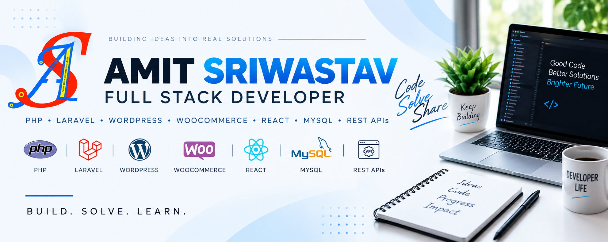
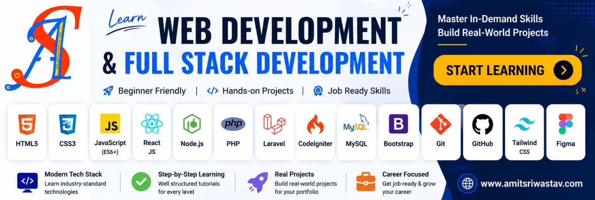

<p align="center">
  
</p>

# 👋 Hi, I'm Amit Sriwastav

### Senior Full Stack Developer | PHP | WordPress | Laravel | React | MySQL | REST APIs

**10+ years of experience** building web applications, REST APIs, eCommerce platforms, business applications and custom WordPress solutions.

<p align="left">
  <a href="https://github.com/amitsriwastav">
    
  </a>
  <a href="https://linkedin.com/in/amitbalaraman">
    
  </a>
  <a href="https://amitsriwastav.com">
    
  </a>
</p>

---

## 👨‍💻 About Me

I'm a Full Stack Developer specializing in **PHP backend development**, with 10+ years of experience building PHP applications, custom WordPress solutions, WooCommerce functionality, REST APIs and modern web interfaces.

I enjoy turning real-world business requirements into **clean, secure, scalable and maintainable software solutions**.

### What I Work With

* 💻 10+ years of experience in Web & API Development
* 🐘 Strong background in PHP and MySQL
* ⚛️ React-based frontend applications
* 🏗️ Full-stack web applications
* 🧩 Experienced in WordPress Plugin & Theme Development
* 🛒 WooCommerce customization & eCommerce
* 🗄️ MySQL database design & optimization
* 🔐 Authentication & authorization
* 🔗 Third-party API & Payment Gateway integrations
* 📱 React Native applications
* 🔧 Git, Composer, Vite and modern development workflows

  ## 💡 What I Specialize In

| Area                   | Focus                                              |
| ---------------------- | -------------------------------------------------- |
| 🐘 **PHP Development** | Core PHP, OOP, PDO, MySQL                          |
| 🧩 **WordPress**       | Custom Plugins & Themes, Gutenberg, ACF, CPT             |
| 🛒 **WooCommerce**     | Product, Cart, Checkout & e-Commerce customization |
| 🚀 **Laravel**         | MVC applications, APIs & Backend systems           |
| ⚛️ **React**           | Modern frontend applications & API integration     |
| 📱 **React Native**    | Cross-platform mobile applications                 |
| 🔌 **API Development** | REST APIs & third-party integrations               |
| 💳 **Integrations**    | Payment gateways & external services               |


---

# 🛠️ Technology Stack

### Backend

<p>

</p>

**PHP · Laravel · CodeIgniter · OOP · MVC · REST APIs**

### Frontend

<p>

</p>

**JavaScript · React · React-Native · jQuery · AJAX · Responsive UI**

### Database

<p>

</p>

**MySQL · Database Design · Query Optimization**

### CMS & eCommerce

<p>

</p>

**WordPress · WooCommerce · Custom Plugin Development · Custom Theme Development · CPT · ACF**

### Tools, Workflow & Development

<p>

</p>

**Git · GitHub · Docker · Composer · Vite · VS Code · API Development**

---

# 🚀 What I Build

**🧩 WordPress & WooCommerce**

Custom WordPress plugins, themes, WooCommerce functionality, admin interfaces, product customizations and third-party integrations.

**🐘 PHP & Laravel Applications**

Business applications, database-driven systems, REST APIs and backend services using PHP, Laravel and MySQL.

**⚛️ React & React Native Applications**

Modern web interfaces and cross-platform mobile applications using React and React Native.

```text
┌─────────────────────────────────────────────┐
│             FULL STACK DEVELOPMENT          │
├─────────────────────────────────────────────┤
│                                             │
│  PHP / Laravel / CodeIgniter               │
│              ↓                              │
│       REST APIs & Services                  │
│              ↓                              │
│       MySQL / Data Layer                   │
│              ↓                              │
│   React / JavaScript Frontend              │
│              ↓                              │
│ WordPress / WooCommerce / Business Apps    │
│                                             │
└─────────────────────────────────────────────┘
```

---

# 📌 Featured Projects & 🚀 Featured Work

> Selected projects demonstrating my experience across PHP, WordPress, WooCommerce, Laravel, React and React Native.

| Project              | Technology         | Focus                    |
| -------------------- | ------------------ | ------------------------ |
| 🔌 WordPress Plugin  | PHP / WordPress    | Plugin Architecture      |
| 🛒 WooCommerce Tools | PHP / WooCommerce  | E-commerce Customization |
| 🚀 Laravel API       | Laravel / MySQL    | REST API Development     |
| ⚛️ React Dashboard   | React / JavaScript | Frontend Development     |
| 📱 GST Calculator    | React Native       | Mobile Application       |

> 🚧 Selected projects are being organized and prepared for publication.

### 🔹 Laravel REST API

A production-oriented API demonstrating authentication, validation, database relationships, API architecture and backend engineering practices.

**Technologies:** `PHP` `Laravel` `MySQL` `REST API`

`Coming Soon`

---

### 🔹 PHP & MySQL Application

A full-stack application demonstrating object-oriented PHP, database design, CRUD operations, authentication and AJAX interactions.

**Technologies:** `PHP` `MySQL` `JavaScript` `AJAX`

`Coming Soon`

---

### 🔹 React Application

A modern frontend application demonstrating reusable components, routing, API integration and responsive UI development.

**Technologies:** `React` `JavaScript` `REST API`

`Coming Soon`

---

### 🔹 WordPress / WooCommerce Plugin

A custom WordPress solution demonstrating plugin architecture, hooks, admin settings, frontend integration and WooCommerce functionality.

**Technologies:** `PHP` `WordPress` `WooCommerce` `JavaScript`

`Coming Soon`

<p align="center">
  
</p>

# 🔥 Contribution Activity

<p align="center">
  
</p>

---

# 🎯 Current Focus

```text
PHP & Laravel
      │
      ├── REST API Architecture
      ├── Authentication & Security
      ├── Database Optimization
      └── Scalable Backend Systems

React
      │
      ├── Component Architecture
      ├── API Integration
      └── Modern Frontend Development

WordPress
      │
      ├── Plugin Development
      ├── WooCommerce
      └── Custom Business Solutions
```

---

# 🧠 Engineering Principles

I believe production software should be:

**Clean** → Easy to understand and maintain

**Secure** → Built with appropriate security practices

**Scalable** → Designed to support future growth

**Performant** → Optimized for real-world usage

**Testable** → Structured for reliable testing

**Documented** → Easy for other developers to understand

---

# 📈 Development Approach

```text
Understand the Requirement
          ↓
Design the Solution
          ↓
Build the Architecture
          ↓
Develop & Integrate
          ↓
Test & Debug
          ↓
Optimize
          ↓
Document
          ↓
Deploy & Maintain
```

---

# 🤝 Let's Connect

<p>
  <a href="https://github.com/amitsriwastav">
    
  </a>
  <a href="https://linkedin.com/in/amitbalaraman">
    
  </a>
  <a href="https://amitsriwastav.com">
    
  </a>
  <a href="mailto:support@amitsriwastav.com">
    
  </a>
</p>

---

## 🤝 Open To
<ul>
<li>PHP Developer opportunities</li>
<li>WordPress / WooCommerce development</li>
<li>Laravel projects</li>
<li>React / React Native projects</li>
<li>Open-source collaboration</li>
<li>Freelance development opportunities</li>
</ul>

## ⭐ Thanks for Visiting

I'm continuously building, learning and sharing practical software engineering projects.

**Feel free to explore my repositories and connect with me on 📧 Email: support@amitsriwastav.com**

